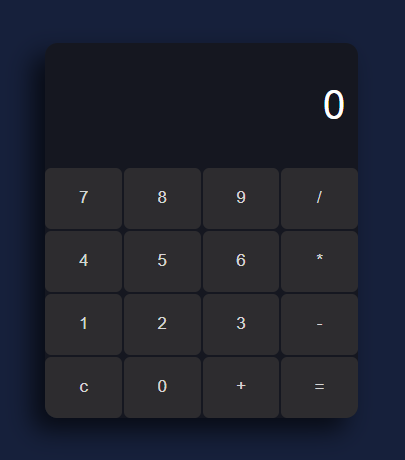

# CALCULADORA JS

- **Calculadora** simple hecha con **HTML**, **CSS** y **JavaScript**.

## Descripción

- Esta es una **calculadora web simple** la cuál permite realizar operaciones matematicas básicas, tales como (**suma**, **resta**, **multiplicación** y **división**)
de manera eficiente.

## Características
- Operaciones básicas: **'+'**, **'-'**, **'*'**, **'/'**
- Validación de operadores duplicados
- Interfaz responsiva con CSS Grid
- Evaluación de expresiones con **"math.js"**

## Tecnologías utilizadas
- **HTML5**
- **CSS3**
- **Javascript**
- **Libreria:** [Math.js](https://mathjs.org/)

## Cómo funciona
La aplicación usa un input como pantalla y botones para los números y operadores.
Cuando el usuario presiona un botón, se actualiza el valor del input.  
Si se detecta un operador repetido, se reemplaza automáticamente.